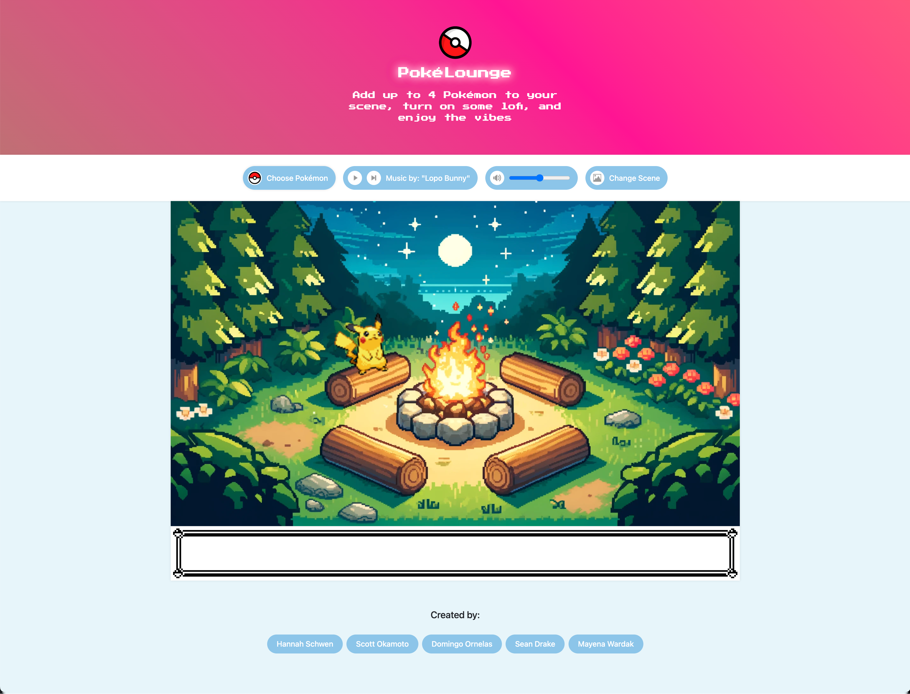
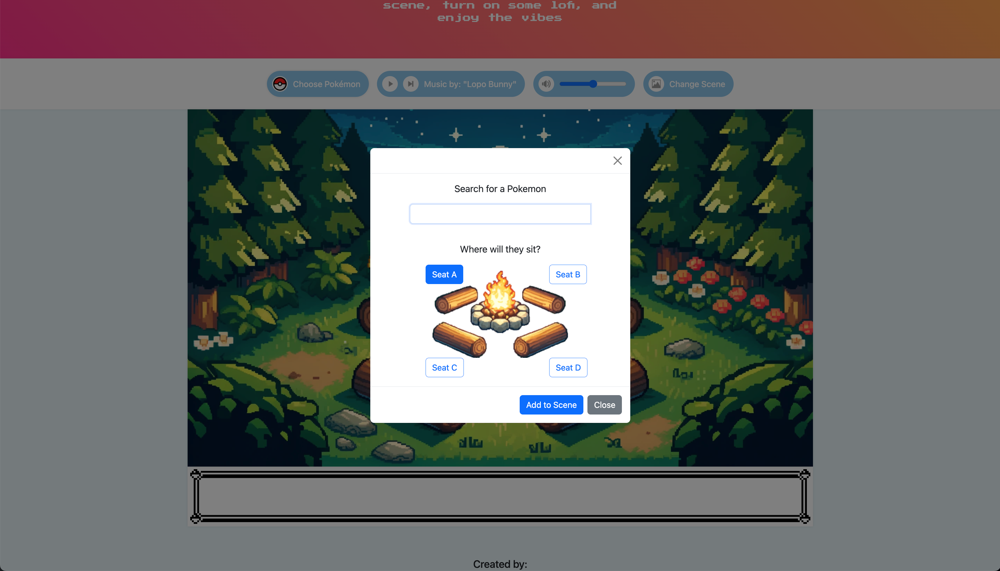

# PokéLounge

## Description

A webpage that gives users the ability to add and remove Pokémon characters with the added functionality of a random quote generater at the bottom of the screen. This app will run in the browser and feature dynamically updated HTML and CSS powered by jQuery.

## Table of Contents

- [General Functionality](#general-functionality)
- [Screenshots](#screen-shots)
- [Installation](#installation)
- [Usage](#usage)
- [Credits](#credits)
- [License](#license)

### General Functionality

This webpage gives users the ability to add up to four Pokémon characters. When they are adding users have the ability to click on the character to hear what their "cry" is - essentially the noise they make. Also, character that are already on the screen can be dragged and dropped in a new location. When a Pokémon is clicked a random quote is generated at the bottom of the screen. 

### Screen Shots

#### The PokéLounge

#### Adding Character by clicking "Choose Pokémon"

#### Changing Background using "Change Scene Button"

#### Deleting Pokémon

### Installation

You may clone the repository for access to the project files directly to copy/paste as needed. You may also fork the repository to utilize git actions to deploy as needed to support your workflows.

Since this is a static code project it may be deployed on any hosting platform supporting static code projects supporting html, css, and javascript including cloud providers:

- [AWS](https://aws.amazon.com/getting-started/hands-on/host-static-website/)
- [Azure](https://learn.microsoft.com/en-us/azure/static-web-apps/getting-started?tabs=vanilla-javascript)
- [Google Cloud](https://cloud.google.com/storage/docs/hosting-static-website)

## Usage

This web project is currently deployed [on Github Pages](https://group11projectpokemon.github.io/group-11-project-pokemon/)

## Credits
 - Hannah Shwen
 - Scott Okamoto
 - Domingo Ornelas
 - Sean Drake
 - Mayena Wardak

## License

This project is licensed with the "Unlicense" license. [(Read more here)](LICENSE)

## How to Contribute

Thank you, but we are not seeking any contributions at this time.